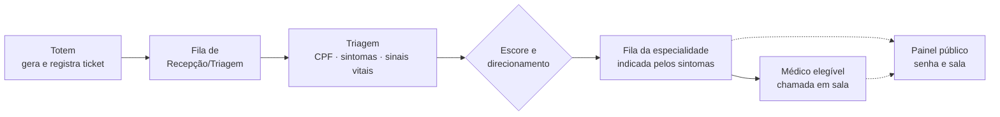

# Sistema de Fila Prioritária para Pronto-Socorro

Sistema web que organiza a entrada e a chamada de pacientes em um pronto-socorro, priorizando pela **gravidade clínica** (sintomas e sinais vitais), e não apenas pela ordem de chegada.


---

## Sobre o projeto

Em muitos prontos-socorros a fila ainda é organizada manualmente, por ordem de chegada. Assim, um paciente com dor no peito pode esperar o mesmo tempo que alguém com um resfriado. Este sistema apoia a equipe de triagem com regras objetivas e auditáveis:

- **classifica** cada paciente em três cores (Vermelha, Amarela e Azul), somando a pontuação de todos os sintomas aos pontos dos sinais vitais;
- **direciona** a ficha à especialidade indicada pelos sintomas e a distribui para um médico elegível, sem restringir atendimento pela especialidade cadastral do profissional;
- **escolhe automaticamente** o próximo paciente a ser chamado, sem que o médico escolha manualmente;
- **informa** o público por um painel de chamadas que não expõe dados pessoais.

> Projeto acadêmico desenvolvido na Faculdade Impacta. As regras clínicas são uma modelagem de estudo e não substituem protocolos reais de triagem.

## Principais funcionalidades

| Área | Funcionalidades |
|---|---|
| **Recepção/Triagem** | Totem e fila de tickets numéricos · identificação por CPF · ficha com sintomas e sinais vitais · classificação automática com ajuste manual justificado · senha e comprovante impresso |
| **Médico** | Fila atribuída por elegibilidade · "Chamar próximo" sem duplicidade · 30 s entre chamadas, até 3 tentativas por oportunidade e uma reentrada ao fim da fila · Pausar/Retomar · encerrar plantão com fila zerada · impressão da ficha |
| **Painel público** | Senha e sala da chamada em destaque · previsão das próximas 5 senhas · sem nome nem CPF |
| **Administrador** | Usuários e perfis · cadastros de Médicos e Recepção/Triagem · especialidades, sintomas e salas · disponibilidade por período · parâmetros e faixas de risco · acompanhamento da fila, da equipe e da auditoria |

## Como funciona



### Regras de priorização

1. **Pontuação de sintomas:** cada sintoma vale de 1 a 3 pontos e todos os sintomas selecionados entram na soma.
2. **Escore clínico:** soma os pontos dos sintomas e dos sinais vitais (incluindo glicemia quando medida). Não há máximo fixo de 18. Os limiares iniciais são 3 para risco moderado e 6 para alto; um item clínico isolado com 3 pontos pode elevar o risco a alto.
3. **Classificação:** baixo → Azul, moderado → Amarela e alto → Vermelha. Idosos, crianças e gestantes reordenam dentro da classificação e não somam pontos.
4. **Direcionamento:** os sintomas determinam a especialidade da ficha. A especialidade de referência do médico é cadastral; um médico elegível pode atender qualquer fila sem alterar a especialidade da ficha.
5. **Chamadas:** 30 segundos entre chamadas da mesma senha, até 3 tentativas por oportunidade e uma única reentrada ao fim da mesma fila. A regra vale para Recepção/Triagem e Médico; desistência explícita remove a senha da fila ativa.
6. **Painel:** a chamada pública pode mostrar a senha e a sala, nunca nome completo ou CPF.

Faixas e limiares clínicos são parametrizáveis. O fuso do projeto é `America/Sao_Paulo`.

## Arquitetura


| Camada | Tecnologia | Responsabilidade |
|---|---|---|
| Frontend | [Reflex](https://reflex.dev) (Python) | Telas e interação. Nenhuma regra de negócio |
| Backend e banco | [Xano](https://www.xano.com) (XanoScript) | Regras, autorização por perfil, persistência e auditoria |
| Especificação | [OpenSpec](https://github.com/Fission-AI/OpenSpec) | Requisitos e planejamento de cada funcionalidade |
| Testes | pytest + httpx | Testes de API com valores-limite das regras |

**Decisões de destaque**
- Autorização aplicada no backend a cada requisição. Desativar um usuário invalida o acesso na hora.
- Seleção do próximo paciente **atômica**, para que dois médicos nunca chamem a mesma ficha.
- Trilha de **auditoria** imutável para prioridade, sintomas, disponibilidade e chamadas.
- **Privacidade:** o painel e o comprovante impresso não exibem dados pessoais.
- **Totem:** faz parte do escopo e terá uma change funcional própria.
- **Plantão:** o Médico pode pausar ou retomar novas atribuições; só encerra o plantão quando sua fila atribuída estiver zerada.

## Design e documentação

| Artefato | Link |
|---|---|
| Protótipo de telas | [Figma — Protótipo de Fluxos](https://www.figma.com/design/38ro8aKQfiGkUivIfCaOR1) |
| Fluxogramas, regras e modelo de dados | [FigJam — Fluxo do Sistema](https://www.figma.com/board/qwAbdFLbo9lRuOym4vDSBI) |
| Visão geral do projeto | [docs/project-overview.md](docs/project-overview.md) |
| Modelo de domínio | [docs/domain-model.md](docs/domain-model.md) |
| Especificações (requisitos e cenários) | [openspec/changes/](openspec/changes/) |
| Referência formal | Confluence: RF01–RF50, RNF01–RNF10, RN01–RN35, UC01–UC12 e CA01–CA15 |

As decisões consolidadas do PO estão nos documentos-base. O Confluence deve permanecer sincronizado; não invente o texto de requisitos ausentes nem reintroduza regras antigas já substituídas.

## Metodologia

O projeto segue o desenvolvimento **orientado a especificação** com [OpenSpec](https://github.com/Fission-AI/OpenSpec), com apoio de agentes de IA:

1. **Contexto:** visão geral, modelo de domínio e regras para os agentes de IA ([AGENTS.md](AGENTS.md)).
2. **Especificação:** cada funcionalidade vira uma *change*, com proposta, requisitos verificáveis (cenários QUANDO/ENTÃO), design técnico e tarefas.
3. **Fatias verticais:** backend e frontend de uma mesma funcionalidade são entregues e testados juntos a cada sprint.
4. **Rastreabilidade:** os requisitos citam os RF/RN/CA do documento formal de requisitos.

## Roadmap

- [x] Levantamento de requisitos, protótipo e modelo de dados
- [x] Especificação das 8 changes funcionais atuais e da base compartilhada
- [x] Banco de dados publicado no Xano (19 tabelas)
- [ ] Autenticação, perfis e gestão de usuários
- [ ] Cadastros do administrador e auditoria
- [ ] Totem (change funcional própria, ainda a planejar)
- [ ] Pré-triagem e cadastro de pacientes
- [ ] Triagem e classificação de risco
- [ ] Direcionamento, senha e comprovante
- [ ] Fila priorizada e chamada pelo médico
- [ ] Painel público
- [ ] Acompanhamento do administrador

## Estrutura do repositório

```
├── docs/                  visão geral e modelo de domínio
├── openspec/
│   ├── config.yaml        contexto e regras da metodologia
│   └── changes/           especificação de cada funcionalidade
├── backend/xano/table/    schema do banco em XanoScript
├── AGENTS.md              regras para agentes de IA
└── CONTRIBUTING.md        guia de ambiente e fluxo de trabalho da equipe
```

## Equipe

| Integrante | Papel |
|---|---|
| Leonardo dos Santos Ferreira | Product Owner · requisitos e regras de negócio · protótipo · banco de dados |
| Leonardo Machado | Backend |
| Luisa | Backend |
| Nicolas Rissato | Frontend |
| Gustavo Garcia | Frontend |

---

Quer rodar ou contribuir? Veja o [guia de contribuição](CONTRIBUTING.md).
